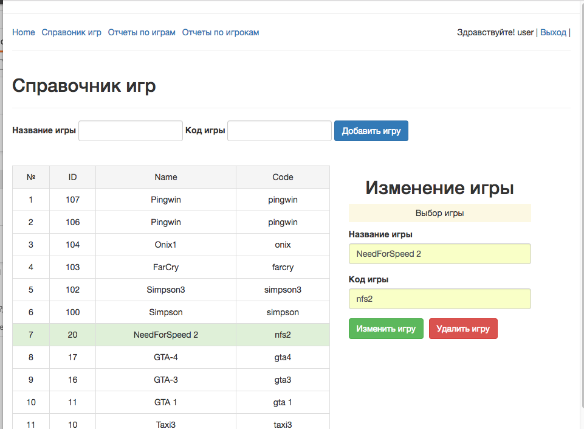

API + front Admin panel

# Api:
- Express
- Sequelize (PostgreSQL)

# Front
- AngularJS
- Chart.js
- Autorization user

# CRUD

# Report 1

# Postgres-Express-Angular
Admin page for users game statistic

sequelize help:model:create

Sequelize Migration

# npm install --save sequelize-cli

# sequelize init  # Initializes the project.

# Model Create
sequelize model:create --name User --attributes 'name:string, email:string, password:string, isAdmin:boolean'

sequelize model:create --name Score --attributes 'score:integer'

sequelize model:create --name Game --attributes 'name:string, code:string'

# Миграция таблиц в базу
sequelize db:migrate        # Run pending migrations.

# sequelize seed:create

# Миграция записей в базы
sequelize db:seed:all

# seed

Запуск проекта
nodemon app.js
